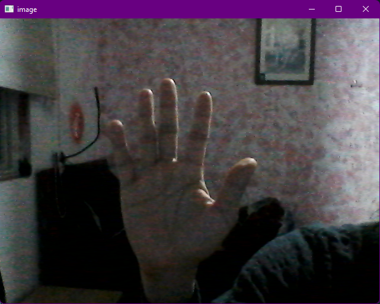
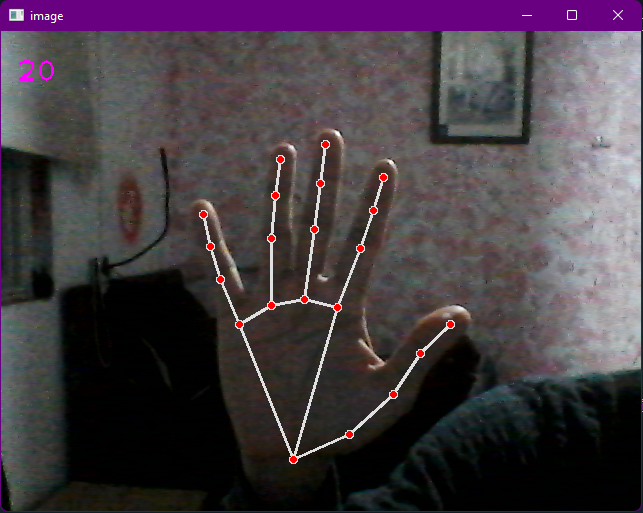
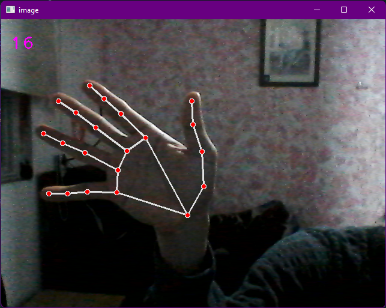

# Hand tracking module
## Using mediapipe and cv2 libraries

### Process
1. importing libraries
2. activating the camera and displaying an image
3. creating mediapipe.Hands object to detect and track hands in the image
4. Extracting the information of the hands


#### 1. importing libraries
```
import cv2
import mediapipe as mp
import time
```
#### 2. Activating the camera with CV2

```
cap = cv2.VideoCapture(0) # open a video file or camera

while:
    success, img = cap.read() # returns (boolean, image)
    if not success: break

    cv2.imshow("image", img)              # displays the image in a window
    if cv2.waitKey(1) & 0xFF == ord('q'): # when we press 'q' the program stops
        break
```



if you have multiple cameras when doing `cv2.videocapture(0)`, you can choose a video camera changing the number `cv2.videocapture(x)`


#### 3. mediapipe.Hands object

```
mpHands = mp.solutions.hands # abbreviation for easy use
hands = mpHands.Hands()      # create hands object
# function to draw points and lines in the hands landmarks
mpDraw = mp.solutions.drawing_utils

while:
    success, img = cap.read()
    if not success: break

    imgRGB = cv2.cvtColor(img, cv2.COLOR_BGR2RGB) # converting BGR image to RGB

    results = hands.process(imgRGB) # the hands object only receives RGB images

    if results.multi_hand_landmarks:                 # if a hand it's detected
        for handlms in results.multi_hand_landmarks: # for each hand:
            mpDraw.draw_landmarks(img, handlms, mpHands.HAND_CONNECTIONS) # draw it


    cv2.imshow("image", img)
    if cv2.waitKey(1) & 0xFF == ord('q'):
        brea1
```
the class Hands detects and tracks hands automatically, you can change several parameters depending of your project,
```
When creating the object mpHands.Hands():
parameters for modifications:
    static_image_mode=False, track and detect base on confidence level (default)
    static_image_mode=True, will do detection part every time, will be more slow
    max_num_hands=2,
    model_complexity=1,
    min_detection_confidence=0.5, will try to detect if there's no tracking
    min_tracking_confidence=0.5): will continue tracking until confidence go below 0.5
```





#### 4. Extracting the information from mpHands

When we