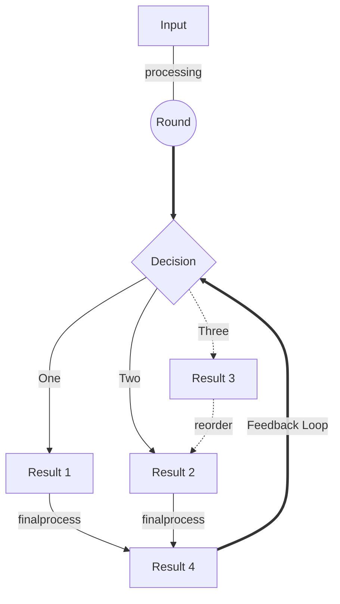
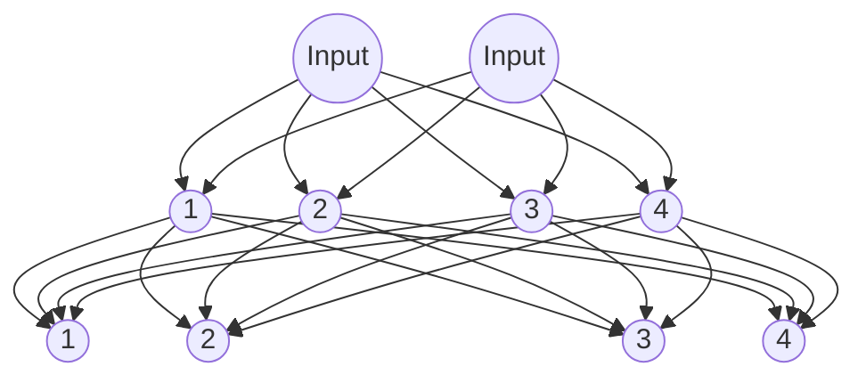

# Computer vision with python 
## Using mediapipe and cv2 libraries

it's important to create the basic instances to display the rest.

using a lot of images to explain what is going on, 

### creating tables
-tener en cuenta
-contenido
-para quien está escrito
-cual es el propósito

|shortcut | what it does|
|-|-|
|Ctrl+T|Show all symbols|
|Ctrl+Shift+Space|Trigger Parameters Hints|

