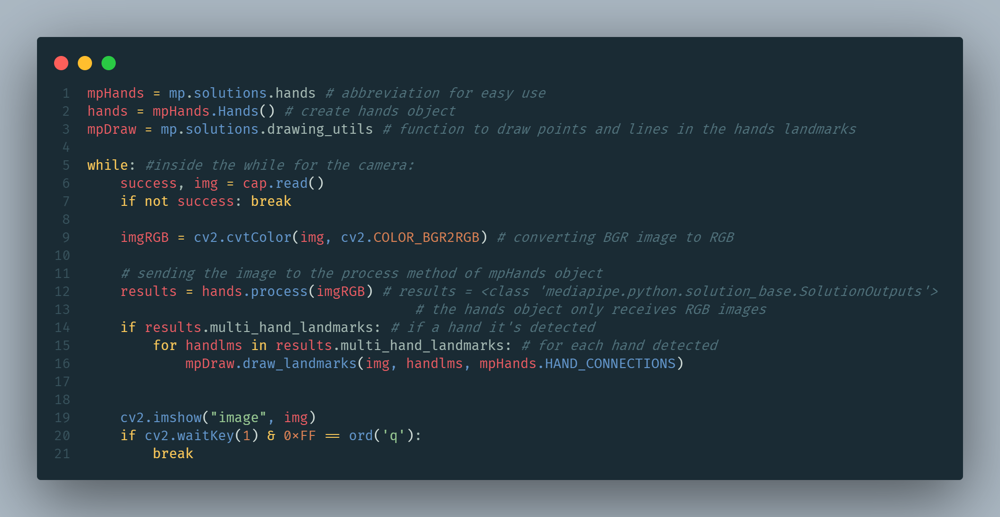

# Computer vision with python
## Using mediapipe and cv2 libraries

### Process
1. importing libraries
2. activating the camera and displaying an image
3. creating mediapipe.Hands object to detect and track hands in the image
4. Extracting the information of the hands object

#### 1. importing libraries

#### 2. Activating the camera with CV2

when doing cv2.videocapture(0), you can choose a video camera changing the number

#### 3. mediapipe.Hands object

#### 4. Extracting the information from mpHands

When we 